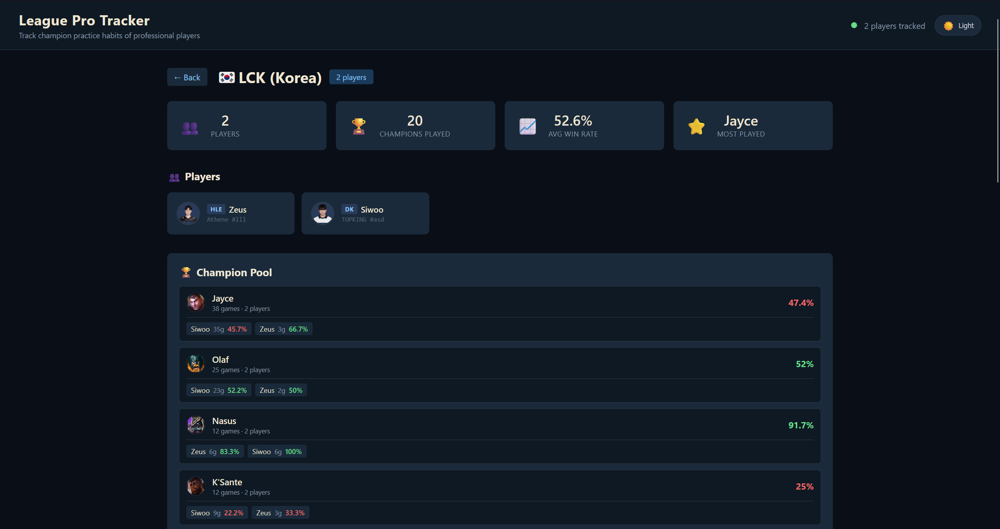
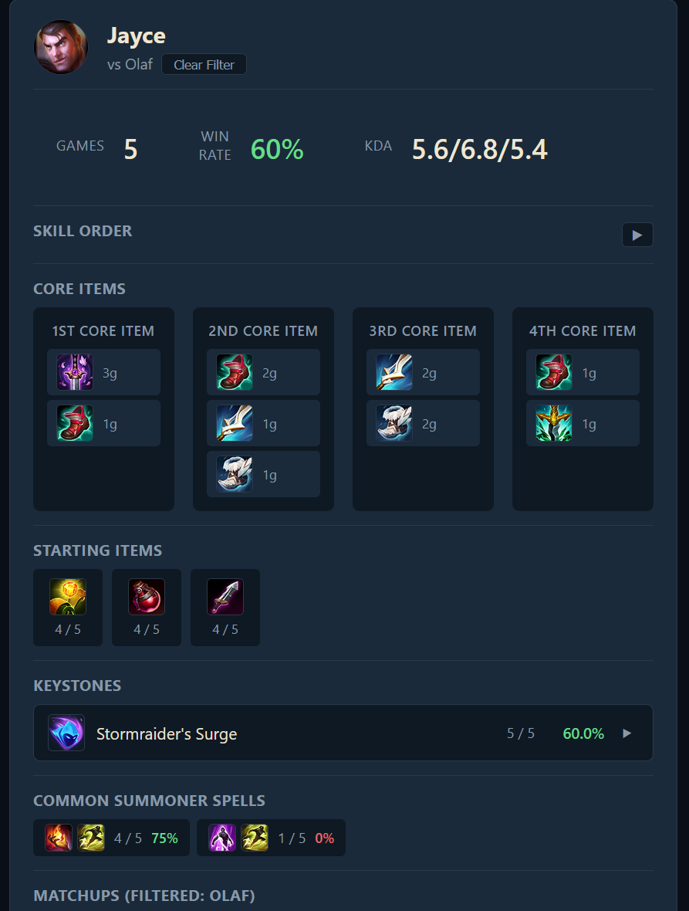
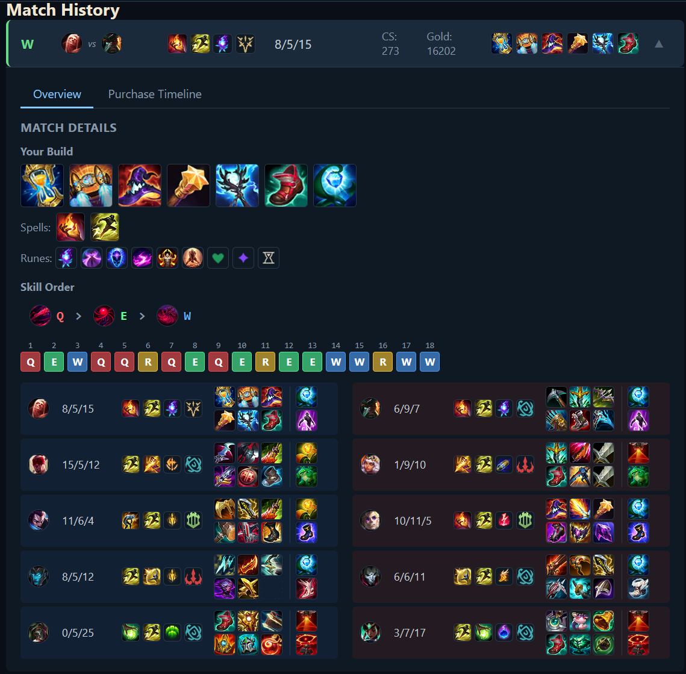

# League Pro Tracker

Track the ranked solo queue practice habits of professional League of Legends players.

Aggregates each pro's recent ranked matches — champion pools, rune pages, item builds, summoner spells, matchup stats, and per-game timelines — into a web UI that answers questions like *"What rune pages does Chovy actually run on Azir?"* and *"Which champions is Zeus practicing this patch?"*





## Features

**Players**
- Pros grouped by region (LCK, LPL, LEC, LCS)
- Team badge, public name, and Riot ID shown together
- Click a player to see their full champion pool

**Player page**
- Champion list sorted by games played
- Click a champion to expand a full statistical breakdown
- Match history on the right, expandable per game

**Champion breakdown**
- Base stats: games, win rate, KDA, CS
- Skill order — priority summary (e.g. `Q > E > W`) plus per-level grid
- Core items — 1st through 4th completed items by usage
- Starting items — filtered to exclude mistake-buys (see design decisions)
- Rune pages — grouped by keystone, expandable to secondary + shard variations
- Summoner spells — combo usage
- Matchups — win rate vs each enemy champion, clickable to filter

**Match history**
- Collapsed card: W/L, champion vs enemy laner, keystone + secondary tree, summoner spells, KDA, items
- Expanded: your full build, skill order, all 10 participants with their runes/items, and a purchase timeline tab

**Region page**
- Champion meta across all tracked players in the region
- Per-champion: total games, win rate, distinct player count
- Per-player breakdown per champion

## Architecture

Riot API, Data Dragon, CommunityDragon
>
RiotAPIClient: match fetching, timeline parsing, Data dragon
>
DatabaseManager: SQLite
>
FastAPI
>
React frontend


**Backend** — Python 3.10+, FastAPI, SQLite, riotwatcher
**Frontend** — React 18, React Router, axios
**External data** — Riot API, Data Dragon (static assets), CommunityDragon (stat shard icons)

## Design decisions

A few parts of Riot's data model required non-obvious handling. These are the interesting bits of the codebase.

### Composite `(match_id, puuid)` key on the `matches` table

When two tracked pros play each other (e.g. Zeus vs Kiin), the same `match_id` belongs to both of them. If `matches` were keyed only by `match_id`, whichever pro's collector ran second would silently skip the match.

The fix is a composite primary key, `(match_id, puuid)`, so each pro gets their own row for the shared game. The `matchups` table has the same problem and the same fix — a matchup is directional (Zeus's matchup vs Kiin is not Kiin's matchup vs Zeus), so it's keyed by `(match_id, puuid, ally_champion_id, enemy_champion_id)`.

Every matchup filter in `get_champion_details` and `get_core_items` includes `AND mu.puuid = m.puuid` for this reason. Without it, the numerator of a matchup filter inflates while the denominator stays per-player.

### Role quest detection via `roleBoundItem`

Riot doesn't expose a "did this ADC complete their role quest" boolean. What they do expose is a `roleBoundItem` field on each participant DTO — the item ID sitting in the role quest slot. For ADCs, that's their boots. For supports, it's their support item.

The frontend uses this to show the role-quest item as a separate slot next to the trinket, and only when it isn't already in the standard inventory. That gives an accurate view of "does this ADC have boots yet" without needing a hypothetical `roleQuestCompleted` field.

### Mistake-buy filtering via `ITEM_UNDO`

Players frequently buy the wrong starting item and undo it within the shop's undo window. Riot doesn't emit `ITEM_SOLD` for that — from the game's perspective the purchase never happened. But it still appears as an `ITEM_PURCHASED` event in the timeline, so the standard approach of "purchases within 60 seconds are starting items" over-counts.

The fix is to capture both `ITEM_SOLD` and `ITEM_UNDO` events in `_extract_item_purchases`, mark the matched purchase with a `sold_timestamp`, and filter those out at the SQL level:

```sql
AND (
    json_extract(value, '$.sold_timestamp') IS NULL
    OR json_extract(value, '$.sold_timestamp') > 60
)
```

Note that 60 just an estimate of mistake buys

Due to Data Dragon not having the stat shard icons, CommunityDragon is used as a replacement
raw.communitydragon.org/latest/game/assets/perks/statmods/.

## Setup

### Prerequistites
```bash
Python 3.10+
Node.js 18+
Riot API key

### BACKEND
# Install Python dependencies
pip install -r requirements.txt

# Configure environment
cp .env.example .env
# Edit .env and set RIOT_API_KEY

# Populate PUUIDs for every player in data/pros.json
# (needed once per player, or when you add new players)
python populate_puuids.py

# Fetch initial match data for all players
python -m src.main

# Start the API
uvicorn src.api.app:app --reload
```

### FRONTEND
```bash
cd frontend

# Install dependencies
npm install

# Configure environment
cp .env.example .env
# Default REACT_APP_API_URL=http://localhost:8000 is correct for local dev

# Start the dev server
npm start
```
### Adding a player
To add a player, look at the format of the json, and run python populate_puuids.py to generate their puuid

### Testing
```bash
python -m pytest tests/ -v -s
```
This test is for the Riot API connection

### Limitations
No implementations for patch/role filtering